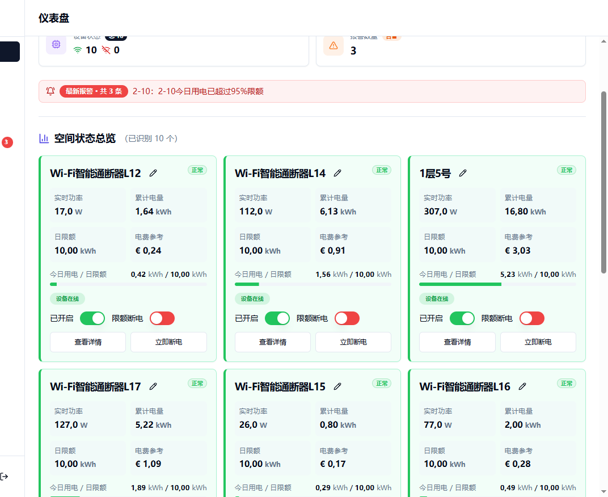

# ZHIRAI Xiaomi Mi Home Apartment Energy Control Platform

ZHIRAI is a Xiaomi / Mi Home apartment energy control platform for monitoring smart power devices, tracking real cumulative electricity usage, managing room-level limits, and operating devices from a responsive dashboard.

## Keywords

Xiaomi, Mi Home, apartment energy manager, smart power control, room electricity dashboard, Xiaomi power switch management, Europe/Vienna energy statistics

## Stack

- React + TypeScript + Vite
- Node.js + Express + Prisma
- PostgreSQL
- Redis
- Docker Compose

## Features

- Xiaomi smart device login and sync
- Real cumulative energy based statistics
- Europe/Vienna business-time calculation
- Daily limits and automatic power cutoff
- Dashboard, charts, alarms, and operation logs
- Mobile-friendly responsive UI

## Screenshot



## Project Structure

- `client/` frontend application
- `server/` backend API and sync logic
- `shared/` shared package
- `deploy/remote/` remote deployment configuration

## Local Development

1. Install dependencies:

```bash
npm install
```

2. Copy the backend env template and fill your own values:

```bash
cp server/.env.example server/.env
```

3. Start development:

```bash
npm run dev
```

Frontend runs on `http://localhost:3000` and backend runs on `http://localhost:3001`.

## Docker

Start the full stack:

```bash
docker compose up -d
```

Before starting Docker, configure your own Xiaomi account credentials through environment variables or an untracked `.env` file. Do not put real credentials directly into committed compose files.

## Notes

- Do not commit real `.env` files or Xiaomi account credentials.
- Energy statistics are designed around real cumulative meter values instead of local estimated accumulation.

## License

This repository is published as source-available software under [`PolyForm Noncommercial 1.0.0`](./LICENSE).

- Allowed: personal study, research, testing, noncommercial learning, and noncommercial modification.
- Not allowed: commercial use, paid redistribution, or using this repository in commercial products or services without separate permission.
